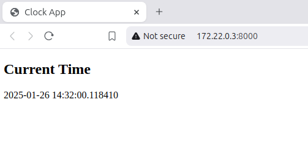

# Flask Clock App with Docker:


## Missions: 
### Clock App (clock_app): 
-	It displays the current time. 
-	Exposes an **API endpoint** to decrement the time. \
    

### Button App (button_app):
-	Contains a button to decrement the time. 
-	Communicates with the **clock_app** by making a POST request to the **API endpoint**. \
     

## Structure:
```
project_folder/
├── apps/
│   ├── clock_app/
│   │   ├── clock_app.py
│   │   ├── Dockerfile
│   │   ├── requirements.txt
│   │   ├── templates/
│   │       └── ...
│   └── button_app/ 
│       ├── button_app.py
│       ├── Dockerfile
│       ├── requirements.txt
│       ├── templates/
│           └── ...
└── docker-compose.yml 
```

## Steps:
### Flask Apps:
-	Two directories: **clock_app** and **button_app**. 
-	In each directory: Python files (**app.py**) and templates(**index.html**). 
-   In the Python files: **button_app** communicates with **clock_app** using the *requests* library. 
-	**clock_app**: Displays the current time and updates it upon **API endpoint** request (/update_time) . 
-	**button_app**: Contains a button to decrement the time and communicates with **clock_app** via **API endpoint**. 
-	In each directory: requirements file (**requirements.txt**: *Flask*, *requests*).
### Dockerfiles:
-	In each directory: **Dockerfile** for the Docker image configuration. 
### Docker Compose File:
-	In the project root: docker-compose file (**docker-compose.yml**).
-	*Services* for both **clock_app** and **button_app**: *build contexts*, *ports* and *environment*(in **button_app**). 
-	Default *network* for communication between the two containers. 
-	Build and Run the Containers:
    ```
    docker-compose up --build
    ```
### Access the Apps:
-	**clock_app** available at http://localhost:5001. 
-	**button_app** available at http://localhost:5002. 
